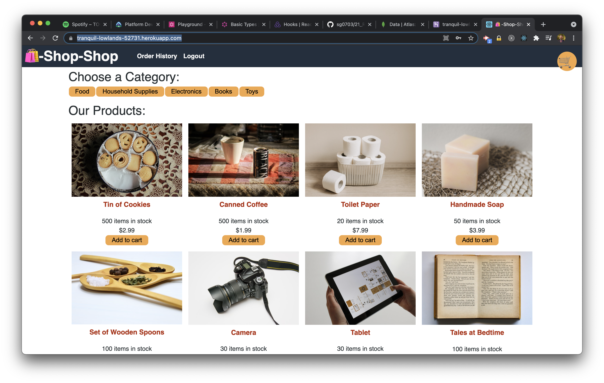
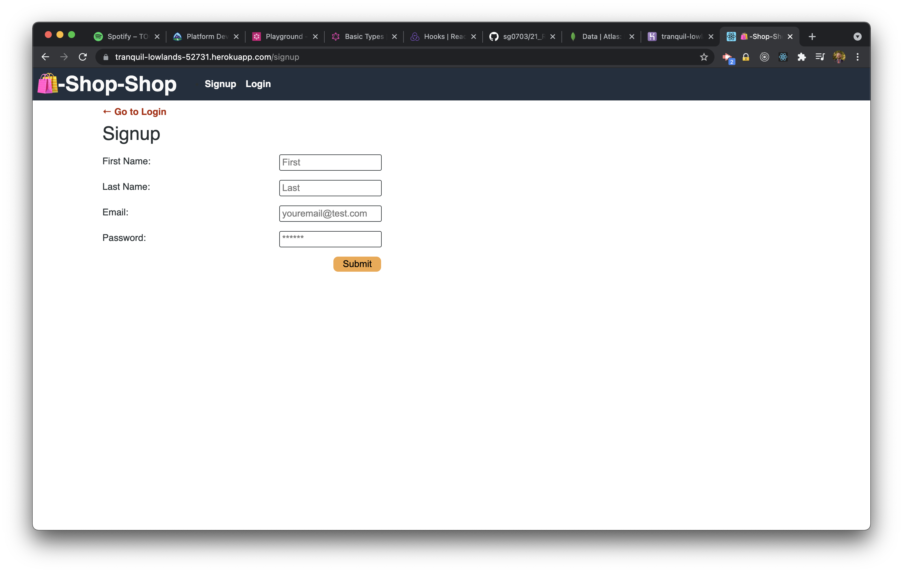
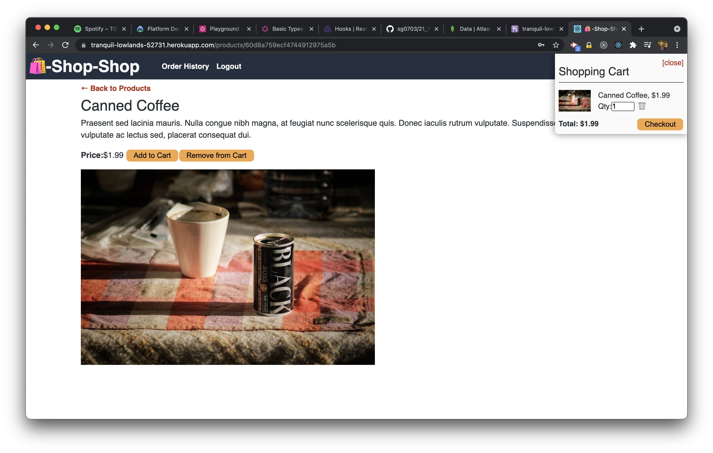

# Redux Store

## Description

Redux store is a full stack e-commerce app that allows users to view items available for sale, create an account, add the items to their shopping cart, and order them using Stripe. This is a refactor of an existing full-stack e-commerce application. The original app used React Context to manage global state. I refactored it to use Redux instead of Context. The app uses MongoDB Atlas, Express, React, Node and Stripe for payment processing.

Please view the deployed version [here](https://tranquil-lowlands-52731.herokuapp.com/).

## Table of Contents

- [Installation](#installation)
- [Usage](#usage)
- [Contribute](#contribute)
- [Test](#test)
- [License](#license)
- [Questions](#questions)

## Installation

Clone the repo, run npm install, and run develop to run locally.

## Usage

This is an e-commerce store app. You can navigate just like any other store, add items to a cart, and check out. There is also a sign up feature so that you can create an account and log in.

## Contribute

Comments and suggestions are appreciated. Feel free to contact me by email.

## Test

Go to the deployed version and try it out, or clone the repo and install the project locally.

## License

Copyright (c) Sam Gates. All rights reserved.
Licensed under the [MIT](https://opensource.org/licenses/MIT) license.

## Questions

Check out my [GitHub Profile](https://github.com/sg0703).

Email with questions! You can reach me at sam.j.gates@gmail.com.
